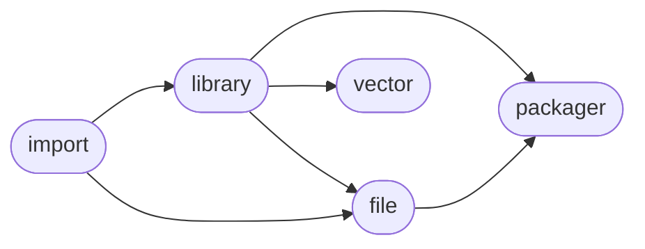

# ManderaGeneral
 - A collection of connected packages.
 - Violently updated with little regard for backwards compatability.
 - Automatic workflows to unittest, sync and publish.

## ManderaGeneral Dependency Diagram

## Information
| Package                                                              | Ver                                                | Latest Release        | Python                                                                                                                                                                                  | Platform        | Cover   |
|:---------------------------------------------------------------------|:---------------------------------------------------|:----------------------|:----------------------------------------------------------------------------------------------------------------------------------------------------------------------------------------|:----------------|:--------|
| [generalfile](https://github.com/ManderaGeneral/generalfile)         | [2.5.12](https://pypi.org/project/generalfile/)    | 2022-10-07 16:07 CEST | [3.8](https://www.python.org/downloads/release/python-380/), [3.9](https://www.python.org/downloads/release/python-390/), [3.10](https://www.python.org/downloads/release/python-3100/) | Windows, Ubuntu | 72.5 %  |
| [generalimport](https://github.com/ManderaGeneral/generalimport)     | [0.2.1](https://pypi.org/project/generalimport/)   | 2022-10-07 16:07 CEST | [3.8](https://www.python.org/downloads/release/python-380/), [3.9](https://www.python.org/downloads/release/python-390/), [3.10](https://www.python.org/downloads/release/python-3100/) | Windows, Ubuntu | 98.4 %  |
| [generallibrary](https://github.com/ManderaGeneral/generallibrary)   | [2.9.10](https://pypi.org/project/generallibrary/) | 2022-10-07 16:07 CEST | [3.8](https://www.python.org/downloads/release/python-380/), [3.9](https://www.python.org/downloads/release/python-390/), [3.10](https://www.python.org/downloads/release/python-3100/) | Windows, Ubuntu | 92.6 %  |
| [generalpackager](https://github.com/ManderaGeneral/generalpackager) | [0.5.4](https://pypi.org/project/generalpackager/) | 2022-10-07 16:07 CEST | [3.8](https://www.python.org/downloads/release/python-380/), [3.9](https://www.python.org/downloads/release/python-390/), [3.10](https://www.python.org/downloads/release/python-3100/) | Windows, Ubuntu | 67.1 %  |
| [generalvector](https://github.com/ManderaGeneral/generalvector)     | [1.5.110](https://pypi.org/project/generalvector/) | 2022-10-07 16:07 CEST | [3.8](https://www.python.org/downloads/release/python-380/), [3.9](https://www.python.org/downloads/release/python-390/), [3.10](https://www.python.org/downloads/release/python-3100/) | Windows, Ubuntu | 53.0 %  |

## Contributions
Issue-creation and discussions are most welcome!

Pull requests are not wanted, please discuss with me before investing any time

Generated 2022-10-15 09:34 CEST

