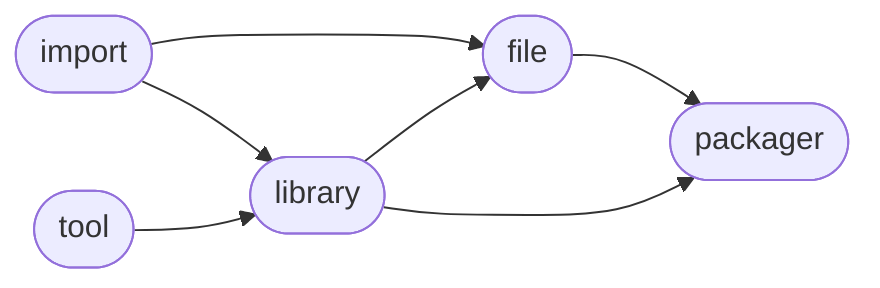

# ManderaGeneral
 - Modularized platform for managing future products.
 - Automatic workflows to unittest, sync and publish.

## Dependency Diagram for ManderaGeneral

## Information
| Package                                                              | Ver                                                 | Latest Release       | Python                                                                                                                                                                                                                                                                                                                | Platform        | Cover   |
|:---------------------------------------------------------------------|:----------------------------------------------------|:---------------------|:----------------------------------------------------------------------------------------------------------------------------------------------------------------------------------------------------------------------------------------------------------------------------------------------------------------------|:----------------|:--------|
| [generalfile](https://github.com/ManderaGeneral/generalfile)         | [2.5.17](https://pypi.org/project/generalfile/)     | 2024-01-24 07:20 CET | [3.8](https://www.python.org/downloads/release/python-380/), [3.9](https://www.python.org/downloads/release/python-390/), [3.10](https://www.python.org/downloads/release/python-3100/), [3.11](https://www.python.org/downloads/release/python-3110/), [3.12](https://www.python.org/downloads/release/python-3120/) | Windows, Ubuntu | 71.9 %  |
| [generalimport](https://github.com/ManderaGeneral/generalimport)     | [0.5.2](https://pypi.org/project/generalimport/)    | 2024-01-24 07:20 CET | [3.8](https://www.python.org/downloads/release/python-380/), [3.9](https://www.python.org/downloads/release/python-390/), [3.10](https://www.python.org/downloads/release/python-3100/), [3.11](https://www.python.org/downloads/release/python-3110/), [3.12](https://www.python.org/downloads/release/python-3120/) | Windows, Ubuntu | 97.2 %  |
| [generallibrary](https://github.com/ManderaGeneral/generallibrary)   | [2.10.0](https://pypi.org/project/generallibrary/)  | 2024-01-24 07:20 CET | [3.8](https://www.python.org/downloads/release/python-380/), [3.9](https://www.python.org/downloads/release/python-390/), [3.10](https://www.python.org/downloads/release/python-3100/), [3.11](https://www.python.org/downloads/release/python-3110/), [3.12](https://www.python.org/downloads/release/python-3120/) | Windows, Ubuntu | 92.4 %  |
| [generalpackager](https://github.com/ManderaGeneral/generalpackager) | [0.5.10](https://pypi.org/project/generalpackager/) | 2024-01-24 07:20 CET | [3.8](https://www.python.org/downloads/release/python-380/), [3.9](https://www.python.org/downloads/release/python-390/), [3.10](https://www.python.org/downloads/release/python-3100/), [3.11](https://www.python.org/downloads/release/python-3110/), [3.12](https://www.python.org/downloads/release/python-3120/) | Windows, Ubuntu | 69.1 %  |
| [generaltool](https://github.com/ManderaGeneral/generaltool)         | [0.1.3](https://pypi.org/project/generaltool/)      | 2024-01-24 07:20 CET | [3.8](https://www.python.org/downloads/release/python-380/), [3.9](https://www.python.org/downloads/release/python-390/), [3.10](https://www.python.org/downloads/release/python-3100/), [3.11](https://www.python.org/downloads/release/python-3110/), [3.12](https://www.python.org/downloads/release/python-3120/) | Windows, Ubuntu | 99.1 %  |

## Contributions
Issue-creation, discussions and pull requests are most welcome!

Generated 2024-01-24 07:21 CET

