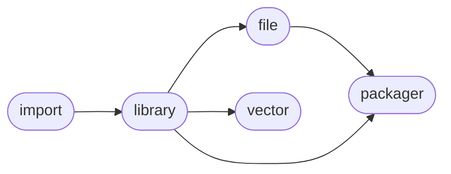

# ManderaGeneral
 - A collection of connected packages.
 - Violently updated with little regard for backwards compatability.
 - Automatic workflows to unittest, sync and publish.

## Dependency Diagram

## Information
| Package                                                              | Ver                                                | Latest Release        | Python                                                                                                                                                                                  | Platform        |   Lvl | Todo                                                         | Cover   |
|:---------------------------------------------------------------------|:---------------------------------------------------|:----------------------|:----------------------------------------------------------------------------------------------------------------------------------------------------------------------------------------|:----------------|------:|:-------------------------------------------------------------|:--------|
| [generalimport](https://github.com/ManderaGeneral/generalimport)     | [0.2](https://pypi.org/project/generalimport/)     | 2022-09-09 12:43 CEST | [3.8](https://www.python.org/downloads/release/python-380/), [3.9](https://www.python.org/downloads/release/python-390/), [3.10](https://www.python.org/downloads/release/python-3100/) | Windows, Ubuntu |     0 | [0](https://github.com/ManderaGeneral/generalimport#Todo)    | 98.2 %  |
| [generallibrary](https://github.com/ManderaGeneral/generallibrary)   | [2.9.9](https://pypi.org/project/generallibrary/)  | 2022-09-09 12:43 CEST | [3.8](https://www.python.org/downloads/release/python-380/), [3.9](https://www.python.org/downloads/release/python-390/), [3.10](https://www.python.org/downloads/release/python-3100/) | Windows, Ubuntu |     1 | [6](https://github.com/ManderaGeneral/generallibrary#Todo)   | 93.0 %  |
| [generalfile](https://github.com/ManderaGeneral/generalfile)         | [2.5.11](https://pypi.org/project/generalfile/)    | 2022-09-09 12:43 CEST | [3.8](https://www.python.org/downloads/release/python-380/), [3.9](https://www.python.org/downloads/release/python-390/), [3.10](https://www.python.org/downloads/release/python-3100/) | Windows, Ubuntu |     2 | [4](https://github.com/ManderaGeneral/generalfile#Todo)      | 72.4 %  |
| [generalvector](https://github.com/ManderaGeneral/generalvector)     | [1.5.19](https://pypi.org/project/generalvector/)  | 2022-09-09 12:44 CEST | [3.8](https://www.python.org/downloads/release/python-380/), [3.9](https://www.python.org/downloads/release/python-390/), [3.10](https://www.python.org/downloads/release/python-3100/) | Windows, Ubuntu |     2 | [1](https://github.com/ManderaGeneral/generalvector#Todo)    | 52.3 %  |
| [generalpackager](https://github.com/ManderaGeneral/generalpackager) | [0.5.3](https://pypi.org/project/generalpackager/) | 2022-09-09 12:44 CEST | [3.8](https://www.python.org/downloads/release/python-380/), [3.9](https://www.python.org/downloads/release/python-390/), [3.10](https://www.python.org/downloads/release/python-3100/) | Windows, Ubuntu |     3 | [16](https://github.com/ManderaGeneral/generalpackager#Todo) | 67.0 %  |

## Contributions
Issue-creation and discussions are most welcome!

Pull requests are not wanted, please discuss with me before investing any time

Generated 2022-09-28 13:08 CEST

