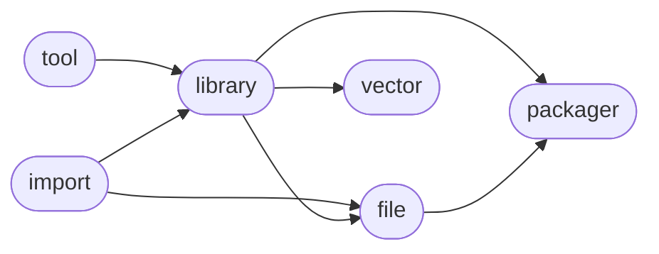

# ManderaGeneral
 - Modularized platform for managing future products.
 - Automatic workflows to unittest, sync and publish.

## Dependency Diagram for ManderaGeneral

## Information
| Package                                                              | Ver                                                | Latest Release        | Python                                                                                                                                                                                                                                                 | Platform        | Cover   |
|:---------------------------------------------------------------------|:---------------------------------------------------|:----------------------|:-------------------------------------------------------------------------------------------------------------------------------------------------------------------------------------------------------------------------------------------------------|:----------------|:--------|
| [generalfile](https://github.com/ManderaGeneral/generalfile)         | [2.5.15](https://pypi.org/project/generalfile/)    | 2023-06-02 23:27 CEST | [3.8](https://www.python.org/downloads/release/python-380/), [3.9](https://www.python.org/downloads/release/python-390/), [3.10](https://www.python.org/downloads/release/python-3100/), [3.11](https://www.python.org/downloads/release/python-3110/) | Windows, Ubuntu | 71.8 %  |
| [generalimport](https://github.com/ManderaGeneral/generalimport)     | [0.5.0](https://pypi.org/project/generalimport/)   | 2023-06-02 23:27 CEST | [3.8](https://www.python.org/downloads/release/python-380/), [3.9](https://www.python.org/downloads/release/python-390/), [3.10](https://www.python.org/downloads/release/python-3100/), [3.11](https://www.python.org/downloads/release/python-3110/) | Windows, Ubuntu | 97.0 %  |
| [generallibrary](https://github.com/ManderaGeneral/generallibrary)   | [2.9.13](https://pypi.org/project/generallibrary/) | 2023-06-02 23:27 CEST | [3.8](https://www.python.org/downloads/release/python-380/), [3.9](https://www.python.org/downloads/release/python-390/), [3.10](https://www.python.org/downloads/release/python-3100/), [3.11](https://www.python.org/downloads/release/python-3110/) | Windows, Ubuntu | 92.3 %  |
| [generalpackager](https://github.com/ManderaGeneral/generalpackager) | [0.5.8](https://pypi.org/project/generalpackager/) | 2023-06-02 23:27 CEST | [3.8](https://www.python.org/downloads/release/python-380/), [3.9](https://www.python.org/downloads/release/python-390/), [3.10](https://www.python.org/downloads/release/python-3100/), [3.11](https://www.python.org/downloads/release/python-3110/) | Windows, Ubuntu | 67.8 %  |
| [generaltool](https://github.com/ManderaGeneral/generaltool)         | [0.1.1](https://pypi.org/project/generaltool/)     | 2023-06-02 23:27 CEST | [3.8](https://www.python.org/downloads/release/python-380/), [3.9](https://www.python.org/downloads/release/python-390/), [3.10](https://www.python.org/downloads/release/python-3100/), [3.11](https://www.python.org/downloads/release/python-3110/) | Windows, Ubuntu | 99.1 %  |
| [generalvector](https://github.com/ManderaGeneral/generalvector)     | [1.5.113](https://pypi.org/project/generalvector/) | 2023-06-02 23:27 CEST | [3.8](https://www.python.org/downloads/release/python-380/), [3.9](https://www.python.org/downloads/release/python-390/), [3.10](https://www.python.org/downloads/release/python-3100/), [3.11](https://www.python.org/downloads/release/python-3110/) | Windows, Ubuntu | 52.3 %  |

## Contributions
Issue-creation, discussions and pull requests are most welcome!

Generated 2023-06-02 23:28 CEST

